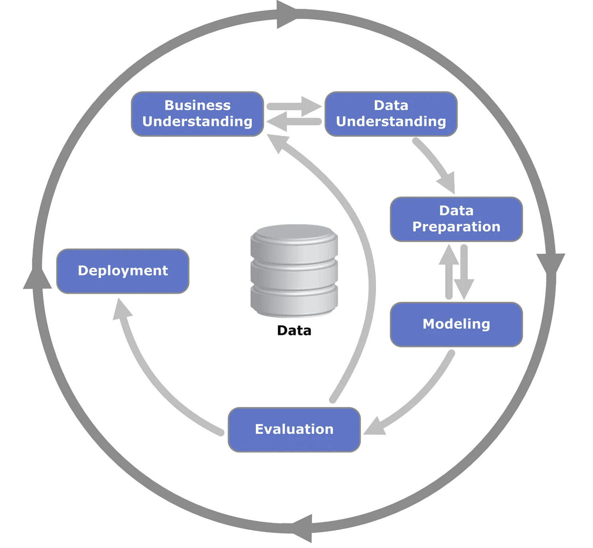

# Insta ML For MSDS

A consolidated repository of the different tools to implement predictive analytics using machine learning (from the _Fundamentals of Machine Learning for Predictive Data Analytics 2e_ Kelleher et. al. 2020) based on the CRoss-Industry Standard Process for Data Mining (CRISP-DM).

# References

- Kelleher JD, Mac Namee B, D'arcy A. Fundamentals of machine learning for predictive data analytics: algorithms, worked examples, and case studies. MIT press; 2020 Oct 20.
